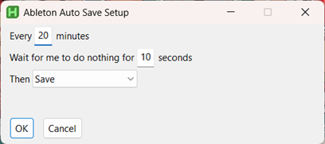
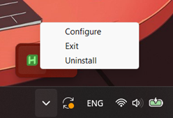
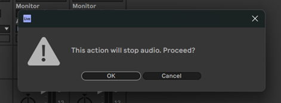

# Ableton Auto-Save

This simple Windows program auto-saves the currenly open Ableton project every few minutes.

## Features

- Choose how often to save.
- Choose between regular save and "Collect All And Save".
- Run on computer startup by default.

## How To Use

Download and run the latest executable from the [releases page](https://github.com/PaperBag42/Ableton-Auto-Save/releases).

Configure the program however you like and press "OK". After that, the program will continue to run in the background.

If you change your mind about any of the configurations, simply right-click on the tray menu icon and choose "Configure" to change them. You can also exit or uninstall the program from this tray menu.

### Note on "Collect All And Save"

Apart from taking up more disk space, Collect All And Save won't work while Ableton is playing audio. Instead, it shows this window:

You can then choose to either stop playing audio and save, or cancel and save later.

## Contributing

Contributions and suggestions are welcome. To compile, install AutoHotkey and run AHK2EXE on `AbletonAutoSave.ahk`.
